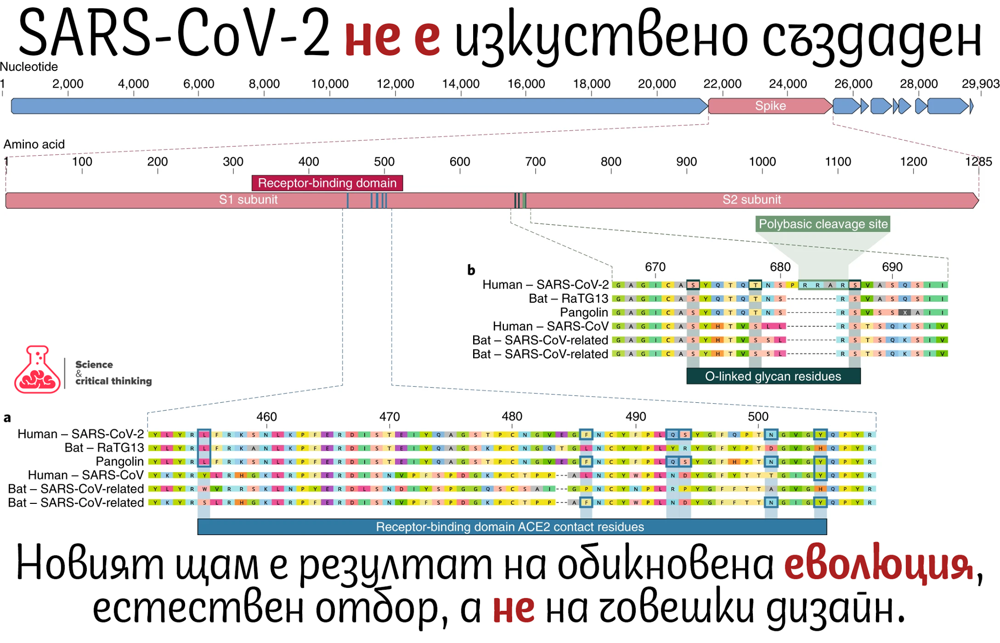

Медицината преди модерните технологии:
- https://www.ncbi.nlm.nih.gov/pmc/articles/PMC2913884/
- https://en.wikipedia.org/wiki/History_of_surgery#Trepanation

## Създаден ли е изкуствено вируса?

Относно вероятността за биотероризъм.
Според мен нито една държава не печели от тази криза.
Освен фирмите губят и банките от тази криза.
- https://www.quora.com/How-does-recession-affect-banks

https://www.facebook.com/science.and.critical.thinking/photos/a.337253216295983/3010774705610474/?type=3&theater

"Вече е официално - новият щам коронавирус си е с напълно естествен и природен произход. Не е създаден от хора. Това е заключение на биоинформатично изследване, публикувано в Nature преди 2 дни.
 
 Анализирани са основно гените, кодиращи повърхностни протеини, които участват в навлизането в животинските клетки и особено на област в тези протеини, наречена рецептор-свързващ домен (RBD) - структура, която се захваща директно за клетките на гостоприемника и медиира навлизането на вируса.
 
 Анализът показва, че RBD областта на повърхностните протеини на вируса проявява висок афинитет към ангиотензин конвертиращ ензим 2 (ACE2 - рецептор, който има участие и в регулиране на кръвното налягане). Ефективността на свързване на двете структури е толкова висока, че учените стигат до заключението, че нещо подобно може да се случи само след естествен отбор, а не чрез генетично инженерство.
 
 Това твърдение за естествената еволюция е потвърдено и чрез анализ на целия геном на SARS-CoV-2. Създаване на нов инженерен вирус от хората би било възможно, ако за основава, за шаблон е използван вече познат човешки патоген (като изминалите причинители на SARS и MERS). Но в случая това не се наблюдава. Най-високо сходство SARS-CoV-2 има с вируси, които са срещат сред прилепи и панголини.
 
 Определени са две възможности за появата на този вирус. Първата теза предвижда, че вирусът е пребивавал в естествен животински резервоар, където се е видоизменял и в един момент е прескочил върху хора. Смята се, че прилепите са естествен резервоар на този щам, но до момента директен преход от прилепи към хора не е наблюдаван. Вероятно е имало междинен преносител.
 Според второто предположение специфичните промени в RBD, които водят до висок афинитет към хора са настъпили след опитите на вируса за трансфер в хора. Непатогенен щам е прескочил в хора, при което се е видоизменил в по-опасна версия.
 
 Отправено е и едно предупреждение за близкото бъдеще. Много е възможно оригиналният щам все още да циркулира в животните и в даден момент отнова да се наблюдава транзиция от естествения животински резервоар към хората, което отново да стартира епидемия/пандемия.
 
 Затова не яжте диви и не добре опечени животни!
 
 Източник: Andersen, K.G., Rambaut, A., Lipkin, W.I. et al. The proximal origin of SARS-CoV-2. Nat Med (2020). https://doi.org/10.1038/s41591-020-0820-9"

Хумористично: Перфектната хигиена https://www.facebook.com/groups/143320586290460/permalink/562997730989408/